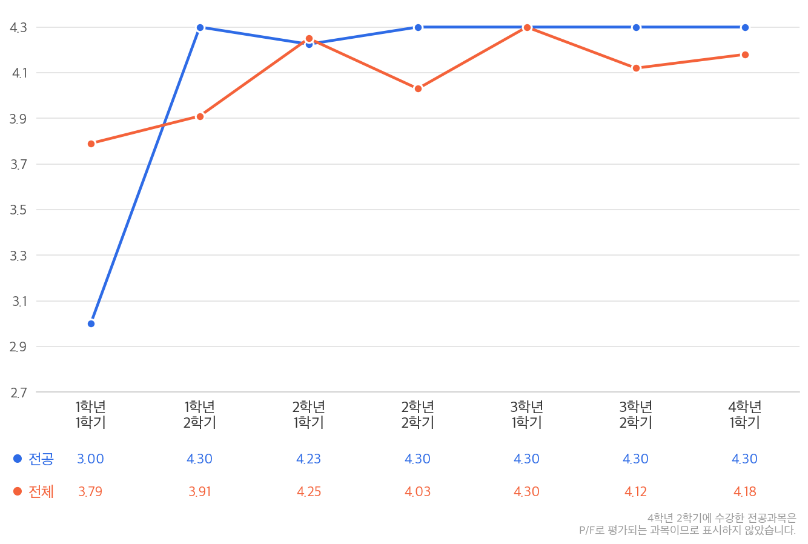

**배움을 나누며 함께 성장하는 것을 추구합니다.** 
스터디를 통해 팀원들과 지식을 공유하는 과정에서 더 큰 성장을 경험합니다. 
신뢰할 수 있는 코드와 탄탄한 전공 지식으로 시스템의 본질을 꿰뚫는 엔지니어가 되고자 합니다.

---

<h2 align="center">🛠️ Tech Stacks</h2>

  <b>Main</b> 
  
  
  
  
  
  
  
  
    
  <b>Sub</b> 
  
  
  

---

<h2 align="center">🎓 Profile</h2>

| | |
|:---:|:---:|
| 학교 | 경북대학교 |
| 전공 | 컴퓨터학부 심화컴퓨터전공 |
| 전체 평균 학점 | 4.08 / 4.3 |
| 전공 평균 학점 | 4.235 / 4.3 |

---

<h2 align="center">🏆 Awards</h2>

| 수상 내용 | 주최 단체 | 수상 일자 | 증빙 자료 |
|:---:|:---:|:---:|:---:|
| 산학협력프로젝트경진대회 우수상 | 경북대학교 소프트웨어교육원 | 2024.12.12 | [상장](documents/awards/241212_산학협력프로젝트경진대회_우수상.jpg) |
| 2024 비전 챌린지톤 대상 | 경북대학교 소프트웨어교육원 | 2024.12.30 | [상장](documents/awards/241230_비전챌린지톤_대상.pdf) |
| APAC Solution Challenge Top 10 | Google Developer Groups, Asian Development Bank | 2025.06.02 | [상장](documents/awards/250602_APACSC_Top10.pdf) |
| 하계종합학술대회 금상 | 한국디지털콘텐츠학회 | 2025.07.05 | [상장](documents/awards/250705_하계종합학술대회_금상.pdf) |
| QI AI Program Outstanding Achievement Award | Qualcomm Institute, UCSD | 2025.07.25 | [상장](documents/awards/250725_QI_AI_Program_Outstanding_Achievement_Award.pdf) |
| 제4회 SW테스트 경진대회 장려상 | 대전정보문화산업진흥원 | 2025.08.27 | [상장](documents/awards/250827_SW테스트경진대회_장려상.pdf) |
| TOPCIT 성적우수상 | 경북대학교 소프트웨어교육원 | 2025.12.10 | [상장](documents/awards/251210_TOPCIT_성적우수상.pdf) |
| 2025 I&T융합프로젝트 입상 | 경북대학교 컴퓨터학부 | 2025.12.22 | [상장](documents/awards/251222_I&T융합프로젝트_입상.pdf) |

---

<h2 align="center">📜 Certifications</h2>

| 자격증 이름 | 등급 | 취득 날짜 | 증빙 자료 |
|:---:|:---:|:---:|:---:|
| TOPCIT | **732**/1000 | 2025.05 | [성적증명서](documents/certifications/250524_TOPCIT_성적증명서.pdf) |
| GCP Machine Learning Engineer | 취득 | 2025.07 | [자격증](documents/certifications/250724_GCPMLE.c0a3331355e747e98dc0722e01567ccd.pdf) |
| OPIc(영어) | IM2 | 2025.08 | [자격증](documents/certifications/250830_OPIc_유우석_저해상도.pdf) |
| SQLD | 취득 | 2025.12 | [자격증](documents/certifications/251212_SQLD_자격증_SQLD-059018619.pdf) |
| 정보처리기사 | 취득 | 2025.12 | [자격증](documents/certifications/251224_정보처리기사_25203041098B.pdf) |

---

<h2 align="center">🔥 Activity</h2>

| 구분 | 활동명 | 직책 | 주관 | 활동 기간 | 비고 |
|:---:|:---|:---:|:---:|:---:|:---:|
| 교육 수강 | 카카오테크캠퍼스 3기 | 백엔드 트랙 | 주식회사 카카오 | 2025.04 ~ 2025.11 | [수료증](documents/completions/251114_카카오테크캠퍼스_수료증.pdf) |
| 교육 수강 | QI AI Entrepreneurship Program | Team Leader | Qualcomm Institute, UCSD | 2025.07 ~ 2025.07 | [수료증](documents/completions/250725_QI_AI_Program_Achievement_Award.pdf)
| 교내 동아리 | Google Developer Groups on Campus KNU | 백엔드 Member | 경북대학교 | 2024.09 ~ 2025.07 | [수료증](documents/completions/250702_GDG_수료증.pdf) |
| 교내 동아리 | 구름톤 유니브 2기 | 부대표, 백엔드 트랙 | 경북대학교 | 2024.09 ~ 2025.01 | [수료증](documents/completions/250111_구름톤유니브_수료증.png) |
| 교내 동아리 | 멋쟁이사자처럼 12기 | 백엔드 트랙 | 경북대학교 | 2024.01 ~ 2024.12 | [수료증](documents/completions/250110_멋쟁이사자처럼_수료증.pdf)
| 커뮤니티활동 | 컴퓨터학부 학생회 | 부학생회장 | 경북대학교 컴퓨터학부 | 2024.12 ~ 2025.12 |  |
| 커뮤니티활동 | 컴퓨터학부 학생회 | 부복학생협의회장 | 경북대학교 컴퓨터학부 | 2023.12 ~ 2024.12 |  |

---

<h2 align="center">🚀 Projects</h2>

### [KNU 80주년 동아리 가두모집 정보 제공 서비스](https://github.com/knu-80)
- **팀원**: 8명(FE: 3명, BE: 5명) | **역할**: 백엔드 개발
- **기간**: 2026.01 ~ 2026.03

> 동아리 가두모집 행사 홍보를 위해 부스 정보, 공지사항, 실시간 인기 동아리 순위를 제공한 웹 서비스

- 서비스 핵심 기능
  - AWS EC2 분산 배포, ALB 트래픽 분산, 롤링 배포로 단일 리전 장애에도 서비스가 유지되는 고가용성 인프라 구축
  - Promtail·Loki·Prometheus 기반 모니터링 아키텍처 구성 및 이상 징후 감지 시 Discord 알림 체계 구축
  - Redis Sorted Set 도입으로 동아리 랭킹 조회 성능을 O(log N)으로 개선, 동시 접속자 1,000명 트래픽 유실 없이 처리
- 결과
  - 총 사용자 4,000명, 동시 접속자 1,000명 달성

- [디스커션](...) | [기타](...)

---

### [Journey Planner 여행 계획 공유 스페이스](https://github.com/kakao-tech-campus-3rd-step3/Team8_BE)
- **팀원**: 7명(FE: 3명, BE: 4명) | **역할**: 팀 리더, 백엔드 개발
- **기간**: 2024.08 ~ 2024.11

> 여행 계획을 실시간으로 함께 작성하고 공유할 수 있는 협업 플랫폼

- 서비스 핵심 기능
  - WebSocket 기반 실시간 동시 편집 기능 구현
  - Redisson 분산 락 적용으로 다중 인스턴스 환경에서 데이터 정합성 보장
  - Node 추상 클래스 기반 컴포넌트 설계로 다양한 편집 요소 통합 관리 및 확장성 확보
- 결과
  - 카카오테크캠퍼스 3기 최종 프로젝트 성공적 완성

---

### [EMA 공학 수학 학습 플랫폼](https://github.com/orgs/2025-ITEC0402/repositories)
- **팀원**: 4명(FE: 1명, BE: 3명) | **역할**: 백엔드 개발, Agent 개발
- **기간**: 2025.03 ~ 2025.07

> 멀티 AI 에이전트를 활용해 개인 맞춤형 공학수학 문제 풀이 및 학습을 지원하는 플랫폼

- 서비스 핵심 기능
  - 단일 LLM의 환각 문제 해결을 위해 LangGraph 기반 Multi-Agent 구조 설계, 에이전트별 역할과 문맥 분리
  - RAG 파이프라인 구축으로 수학 도메인 특화 답변 품질 향상
  - FastAPI 기반 AI 백엔드 서버 구축 및 서빙
- 결과
  - 한국디지털콘텐츠학회 하계종합학술대회 금상 수상

---

